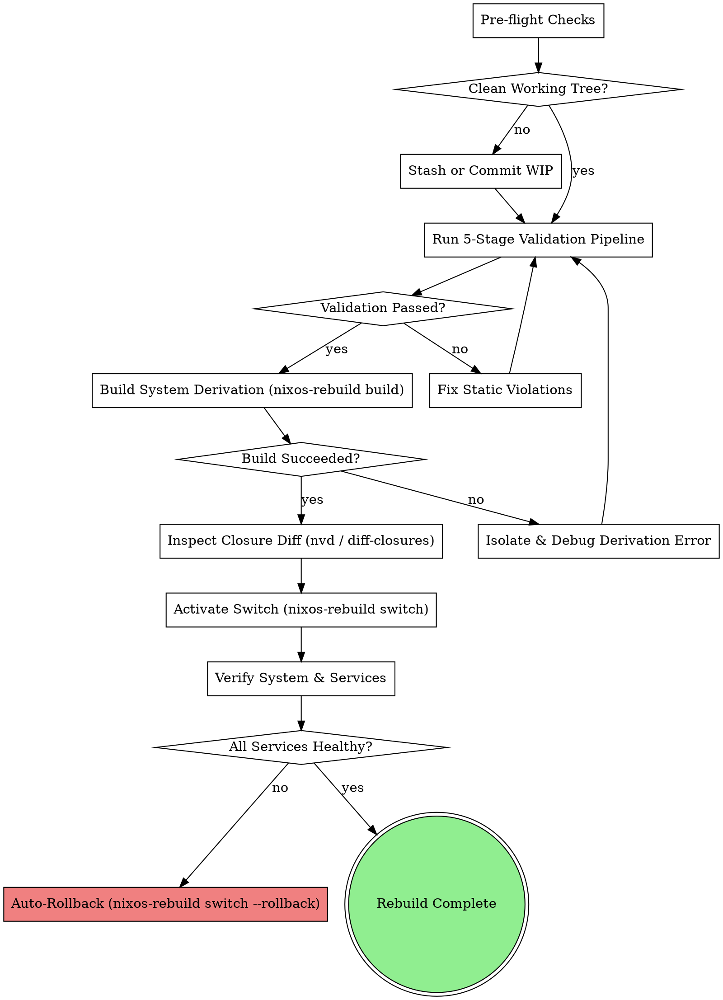

# NixOS System Rebuild & Safe Deployment

Disciplined workflow for safely rebuilding, evaluating, verifying, and activating NixOS systems in NixOS-WSL environments.

**Core Principle:** Always build and diff before switching. Never introduce unmanaged mutable state or commit broken flake configurations.

## The Rebuild Lifecycle



## Phase 1: Pre-flight Checks

1. **Verify Git State**: Nix flakes only see files tracked by Git!
   ```bash
   git status
   ```
   If new files exist, stage them intent-to-add so the Nix evaluator can see them:
   ```bash
   git add -N <new-file>
   ```

2. **Verify Disk Space in Nix Store**:
   ```bash
   df -h /nix
   ```
   If disk usage exceeds 90%, run garbage collection before rebuilding:
   ```bash
   nix-collect-garbage -d
   ```

## Phase 2: 5-Stage Validation Pipeline

Run the validation suite before triggering any system build:

```bash
# 1. Code Formatting
nix fmt -- .

# 2. Anti-pattern Analysis
statix check .

# 3. Dead Code Detection
deadnix .

# 4. Flake Output & Derivation Evaluation
nix flake check --impure

# 5. Pipeline Runner (if available)
bash modules/scripts/validate.sh
```

**Rule:** Every violation must be fixed before proceeding. Do not bypass `--no-check` or force switches on failing evaluations.

## Phase 3: Build Before Switch

Always test compilation without activating:

```bash
sudo nixos-rebuild build --flake .#nixos --show-trace
```

This creates a `./result` symlink pointing to the newly generated system closure in `/nix/store/` without touching running services or switching the boot loader.

## Phase 4: Inspect Closure Diff

Before activating, inspect what packages and versions are changing:

```bash
# Using nvd (if installed):
nvd diff /run/current-system ./result

# Or using native nix store diff:
nix store diff-closures /run/current-system ./result
```

Verify that only expected changes are being introduced.

## Phase 5: Safe Activation & Health Verification

Activate the new configuration:

```bash
sudo nixos-rebuild switch --flake .#nixos
```

Immediately test system health:

```bash
# Check user systemd units
systemctl --user --failed

# Check system systemd units
systemctl --failed

# Check active agent skills sync status
dots-sync-skills status
```

## Phase 6: Automated Rollback Procedure

If any critical unit or service fails to activate:

1. **Rollback instantly**:
   ```bash
   sudo nixos-rebuild switch --rollback
   ```
2. **Document failure logs**:
   ```bash
   journalctl -xe --no-pager -n 100
   ```
3. **Diagnose and remediate** using `nix-derivation-debugging` or `systematic-debugging`.
