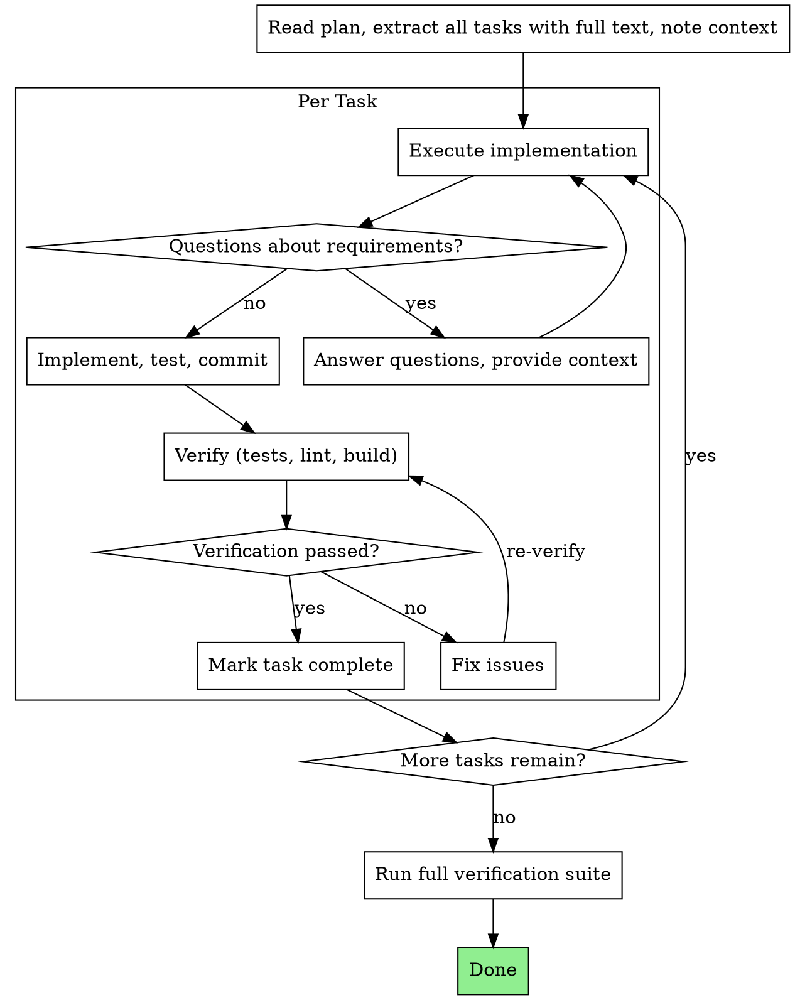

# Single-Flow Task Execution

Execute plans by working through one task at a time, verifying each before moving to the next.

**Core principle:** One task at a time + verification after each = disciplined, high-quality iteration.

## Antigravity Execution Model

Antigravity operates in a focused, single-flow execution thread per agent context.

**Rules:**

1. **One active task only** — never work on multiple tasks simultaneously within the primary flow.
2. **One primary execution thread** — sequential step execution ensures deterministic, high-quality output.
3. **No phantom dispatch** — Antigravity does not have phantom subagent dispatch tools. Use official tools (`run_command`, `browser_subagent`, `manage_task`, `schedule`).
4. **Browser automation** — Use `browser_subagent` for isolated browser tasks.
5. **Track progress** — Update native planning artifacts (`implementation_plan.md`, `walkthrough.md`) and/or `<project-root>/docs/plans/task.md` at each state change.
6. **Structured task units** — Clearly delineate each unit of work with an explicit task brief and verification plan.

## When to Use

**Use when:**

- You have an implementation plan with multiple independent tasks
- 2+ test files failing with different root causes (work through them one at a time)
- Multiple subsystems broken independently
- Each problem can be understood without context from others
- Structured execution with verification gates is needed

**Don't use when:**

- Failures are related (fix one might fix others) — investigate together first
- Tasks are tightly coupled and need full system understanding
- Single simple task that doesn't need execution structure

## The Process



## Task Decomposition

When facing multiple problems (e.g., 5 test failures across 3 files):

### 1. Identify Independent Domains

Group failures by what's broken:

- File A tests: User authentication flow
- File B tests: Data validation logic
- File C tests: API response handling

Each domain is independent — fixing authentication doesn't affect validation tests.

### 2. Create Task Units

Each task gets:

- **Specific scope:** One test file or subsystem
- **Clear goal:** Make these tests pass / implement this feature
- **Constraints:** Don't change unrelated code
- **Expected output:** Summary of what changed and verification results

### 3. Execute Sequentially

Work through each task one at a time using the full verify cycle.

### 4. Final Verification

After all tasks:

- Run full test suite to verify no regressions
- Check for conflicts between task changes

## Task Brief Structure

For each task, prepare:

```markdown
### Task Step: Implement Task N: [task name]

#### Task Description
[FULL TEXT of task from plan — paste it here]

#### Context
[Where this fits, dependencies, architectural context]

#### Constraints
- Only modify [specific files/directories]
- Follow existing patterns in the codebase
- Write tests for new functionality

#### Verification
- Run: [specific test command]
- Expected: [what success looks like]
```

**Key:** Provide full task text and context upfront. Don't make the execution step re-read the plan file.

## Checkpoint Pattern

At logical boundaries (after each task, at major milestones), report:

- **What changed** — files modified, features implemented
- **What verification ran** — test results, lint results
- **What remains** — remaining tasks, known issues

Update `docs/plans/task.md` with current status.

## Common Mistakes

**Task scoping:**

- **Bad:** "Fix all the tests" — loses focus
- **Good:** "Fix user-auth.test.ts failures" — clear scope

**Context:**

- **Bad:** "Fix the validation bug" — unclear where
- **Good:** Paste error messages, test names, relevant code paths

**Constraints:**

- **Bad:** No constraints — task might refactor everything
- **Good:** "Only modify src/auth/ directory"

**Output:**

- **Bad:** "Fix it" — no visibility into what changed
- **Good:** "Report: root cause, changes made, test results"

## Example Workflow

```
You: I'm using single-flow-task-execution to execute this plan.

[Read plan file: docs/plans/feature-plan.md]
[Extract all 5 tasks with full text and context]
[Update docs/plans/task.md with all tasks as 'not_started']

--- Task 1: Hook installation script ---

[Prepare task brief with full text + context]

Questions: "Should the hook be installed at user or system level?"
Answer: "User level (~/.config/superpowers/hooks/)"

Implementation:
  - Implemented install-hook command
  - Added tests, 5/5 passing
  - Committed

Verification: All tests pass, lint clean.

[Mark Task 1 complete in docs/plans/task.md]

--- Task 2: Recovery modes ---

[Prepare task brief with full text + context]

Implementation:
  - Added verify/repair modes
  - 8/8 tests passing
  - Committed

Verification: Tests pass, but found missing progress reporting.

[Fix: add progress reporting]
[Re-verify: all tests pass]

[Mark Task 2 complete in docs/plans/task.md]

... [Continue through remaining tasks] ...

[After all tasks complete]
[Run full verification suite]
All tests pass, no regressions. Done!
```

## Red Flags

**Never:**

- Start implementation on main/master branch without explicit user consent
- Skip verification after each task
- Work on multiple tasks simultaneously
- Skip scene-setting context (task needs to understand where it fits)
- Accept "close enough" on verification (tests fail = not done)

**If you have questions about requirements:**

- Ask clearly and wait for answers
- Don't guess or make assumptions
- Better to ask upfront than rework later

## Completion

Before claiming all work is done:

1. Ensure all task entries in `docs/plans/task.md` are `done` or `cancelled`
2. Run full test/validation command
3. Verify no regressions across all tasks
4. Summarize evidence (test output, verification results)

## Integration

**Required workflow skills:**

- **using-git-worktrees** — Set up isolated workspace before starting
- **writing-plans** — Creates the plan this skill executes

**Should also use:**

- **test-driven-development** — Follow TDD for each task
- **verification-before-completion** — Final verification checklist

**Alternative workflow:**

- **executing-plans** — Use for worktree-based parallel session execution
